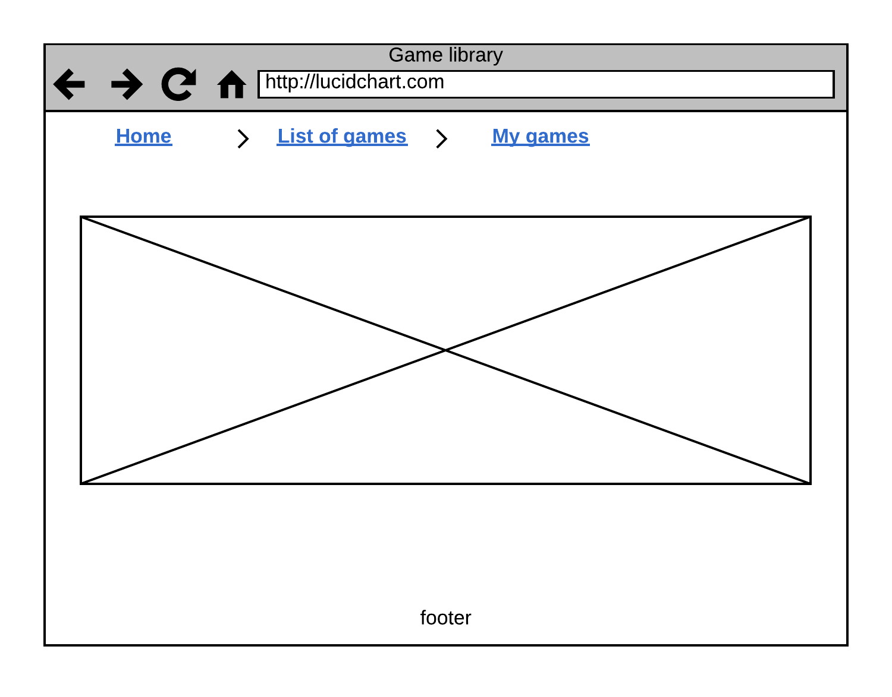
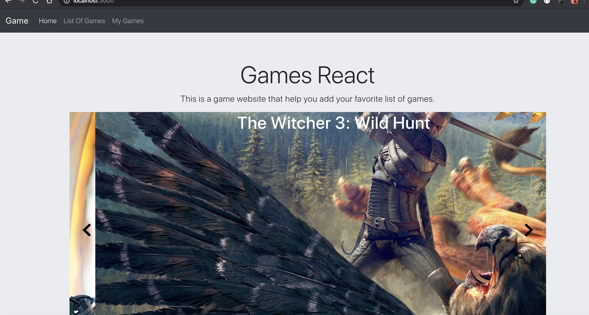

# Project-React-Game-website

### Deployed link:
[Game Website](https://moh1415.github.io/Project-React-Game/)

### Game-website overview
Basic website for manging your favorite games and keep a record of all your games
### Technologies used

1. React
2. Postman
3. bootstrap
4. Axios

### Wireframes image

### UI

### User Stories
* As a user, I should be able to get a list of games on the website.
* As a user, I should be able to add a game to add to has games list.
* As a user, I should be able to add has own game and add to his game list.
* As a user, I should  be able to remove by click to remove selected game or clear all list of his games
* As a user, I should be able to edit the game name.

### Unsolved problems
None

### Future Improvements:
* User could write reviews

